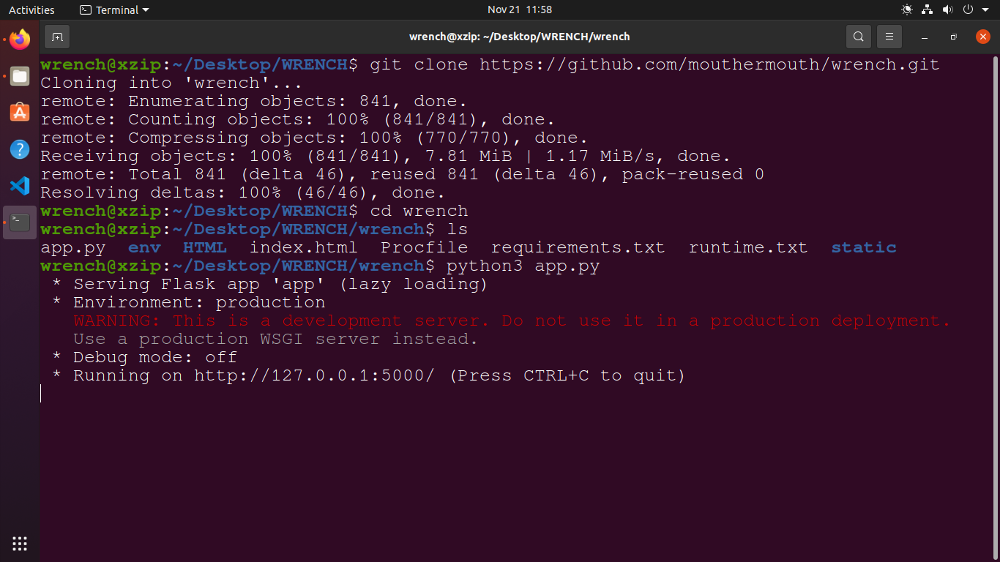

# Wen by mouthermouth
##Welcome all, due to time strain we could make this website project by a 
little approach.
We are very sorry for presenting you this website. We humbly request you to follow
the steps to access out website :

STEP - 1 :
Install the Python programming labnguage for the official site : https://python.org/downloads

STEP 2 : 
Install Git SCM from the official site : https://git-scm.com/downloads and download for Windows 10

STEP 3 : Change directory in which all files are there 
For example 'WRENCH' is the parent folder open terminal.
cd wen 
python app.py

This will generate a link that can be viewed.

This website is opensource and hosted by GitHub on https://github.com/mouthermouth/wen

## run the application :
## You must have python installed on the base system.
## python.org/downloads: Windows OS

## Linux has pre installed Python to install `pip` type : `sudo apt install flask`
## `pip install flask`
## `python3 app.py`

python3 app.py will generate a local server.
</img>
